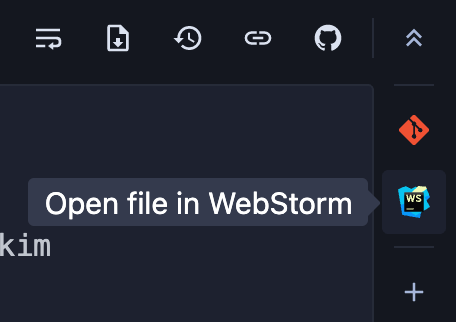
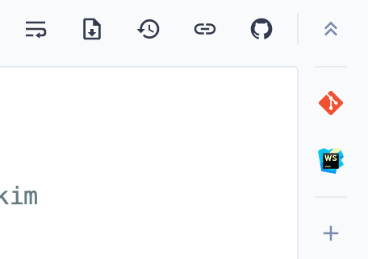

# Open in WebStorm Sourcegraph extension

Provides a button for the sidebar of the Sourcegraph app that will open the current file in [WebStorm](https://www.jetbrains.com/webstorm/).

Based on [sourcegraph/sourcegraph-open-in-intellij](https://github.com/sourcegraph/sourcegraph-open-in-intellij).

## Settings

- `openInWebstorm.basePath` - The absolute path on your computer where your git repositories live. This extension requires all git repos to be already cloned under this path with their original names. `"/Users/yourusername/src"` is a valid absolute path, while `"~/src"` is not.

